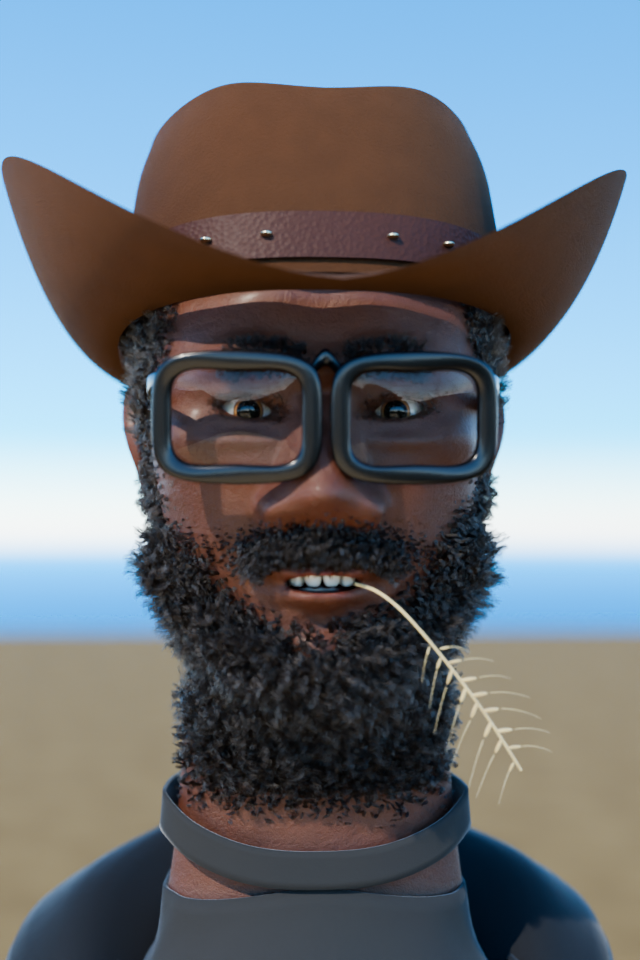

# Portrait 3D photoréaliste — génération 100 % procédurale sous Blender

Ce dépôt construit **entièrement par code** (Python + Blender/Cycles) un portrait
de personnage réaliste inspiré d'une photo de référence : homme noir barbu, chapeau
de cowboy en feutre brun, grosses lunettes noires en acétate, brin de blé au coin
des lèvres, veste à capuche noire, plein soleil de désert.

Aucun asset externe : pas de modèle importé, pas de texture bitmap, pas de HDRI.
Tout — anatomie, peau, poils, chapeau, lunettes, tissu, décor — est généré par des
fonctions mathématiques puis rendu en path tracing.



## Lancer un rendu

```bash
# environnement (Blender fourni comme module Python)
python3.11 -m venv bpyenv && bpyenv/bin/pip install bpy

# aperçu rapide (~2 min sur 4 cœurs)
bpyenv/bin/python scripts/render.py --res 640x960 --samples 64 --quality 0.6 \
    --out renders/apercu.png

# rendu final
bpyenv/bin/python scripts/render.py --res 1024x1536 --samples 400 --quality 1.0 \
    --out renders/portrait.png

# étude de la sculpture seule, en argile, sous 3 angles
bpyenv/bin/python scripts/preview_head.py --views front,side,three --parts all
```

Options de `scripts/render.py` :

| option | rôle |
|---|---|
| `--res LxH` | résolution |
| `--samples N` | échantillons Cycles (adaptatif + débruitage OIDN) |
| `--quality f` | densité de poils : `0.25` pour tester, `1.0` pour le final |
| `--cam` | `portrait`, `face`, `profile`, `wide` |
| `--exposure` | correction d'exposition en EV |
| `--save f.blend` | enregistre aussi la scène `.blend` |

## Comment c'est construit

### 1. La tête : un loft anatomique, pas une sphère déformée

`character/anatomy.py` contient la table anthropométrique (menton à l'origine,
+Y vers le regard, tout en mètres) : hauteur menton→vertex 22,6 cm, ligne des
yeux à mi-hauteur, tiers du visage canoniques, largeur bizygomatique, etc.

`character/head.py` empile des anneaux **super-elliptiques** le long de Z. Chaque
anneau a sa demi-largeur, son avancée, son recul et deux exposants distincts
(avant / arrière) : c'est ce qui permet d'avoir un visage plat de face, un crâne
rond derrière et un menton en pointe, avec une seule surface propre et une
topologie régulière. Les anneaux sont répartis par densité variable (beaucoup
autour des yeux et de la bouche, peu sur l'occiput).

Par-dessus, une pile de déformations locales joue le rôle de la brosse « grab »
du sculpteur, mais définie analytiquement : arcade sourcilière, pommettes,
masséter, bord de la mandibule, sillon naso-génien, philtrum, lèvres, ailes du
nez… Chaque coup est un noyau ellipsoïdal C² poussé dans une direction donnée.

Deux détails comptent beaucoup pour sortir de l'effet mannequin :

* les **narines** sont creusées vers l'arrière **et** vers le haut, ce qui crée
  un vrai surplomb sous la pointe du nez — impossible à obtenir avec un simple
  déplacement frontal ;
* une **asymétrie** discrète est ajoutée (une narine plus haute, une commissure
  plus basse, un sourcil décalé) plus un bruit basse fréquence. Un visage
  parfaitement symétrique se lit immédiatement comme une image de synthèse.

### 2. Les ouvertures : découper proprement

Fente des paupières et bouche entrouverte sont obtenues en supprimant des faces,
ce qui laisse forcément un bord en escalier. Trois passes corrigent ça
(`meshtools.py`) :

1. `snap_boundary` projette chaque sommet du bord sur le contour idéal (deux
   demi-ellipses raccordées — le raccord donne exactement les deux coins de
   l'œil) ;
2. `relax_region` applique un lissage laplacien pondéré à la couronne de
   sommets autour du trou, bord épinglé ;
3. `extrude_boundary_inward` extrude le bord vers l'intérieur pour donner son
   épaisseur au bord libre de la paupière et à l'ourlet des lèvres.

Les globes oculaires restent en repère canonique (pupille vers +Y local) et
c'est **l'objet** qu'on oriente vers la caméra : le shader lit la coordonnée
Object pour placer sclère, limbe, iris et pupille, il faut donc que le repère
local suive le regard.

### 3. La peau : des attributs de sommets plutôt que des textures

`character/skin_attributes.py` calcule analytiquement trois attributs, écrits
sur le maillage et lus par le shader :

* `skin_tint` — lèvres plus violacées, cerne périorbitaire, ailes du nez et
  oreilles plus rouges (peau fine et vascularisée), zone de barbe assombrie,
  cou plus sombre ;
* `skin_oil` — front, dos du nez, pommettes et menton plus gras, donc moins
  rugueux : c'est ce qui produit les reflets spéculaires du plein soleil ;
* `skin_sss` — diffusion sous-cutanée forte sur les oreilles, les ailes du nez
  et les lèvres, faible ailleurs.

Le shader (`materials.py`) ajoute trois niveaux de relief empilés — méso-relief,
grain, pores en Voronoï — et un spéculaire légèrement chaud : sur une peau très
pigmentée, un spéculaire neutre prend la couleur du ciel et voile tout de bleu.

### 4. La pilosité

Systèmes de particules « hair » pilotés par des groupes de sommets, eux aussi
calculés (`character/hair.py`) : ligne de barbe qui descend du favori vers la
commissure, moustache raccordée à la barbe aux commissures, arc des sourcils,
cils implantés le long du contour de la fente palpébrale, golfes temporaux et
favoris pour l'implantation des cheveux. Le frisottis vient d'un kink `CURL`.

### 5. Accessoires et décor

* **Chapeau** (`hat.py`) — calotte super-elliptique creusée d'un pli cattleman
  (gouttière centrale, deux pincements avant), bord dont la hauteur du liseré
  dépend de l'angle (plongeant devant, franchement relevé sur les côtés),
  bandeau de cuir et rivets. Porté rejeté en arrière de 8,5°, ce qui place
  l'ombre du bord juste sous les yeux comme sur la photo.
* **Lunettes** (`glasses.py`) — cercles, pont et branches obtenus en balayant un
  profil rectangulaire arrondi le long d'un chemin. Les verres sont traités
  antireflet (mélange transparent / glossy piloté par Fresnel) : sans ça ils
  deviennent deux miroirs de ciel et on perd les yeux.
* **Brin de blé** (`straw.py`) — chaume, quinze grains alternés et leurs barbes.
* **Vêtements** (`clothing.py`) — aucune découpe : l'encolure du t-shirt et
  l'ouverture en V de la veste viennent d'une hauteur de bord supérieure qui
  dépend de l'angle azimutal. Capuche affaissée derrière la nuque, fermeture
  éclair, plis basse fréquence.
* **Décor** (`scene.py`) — ciel physique (diffusion multiple), soleil dur, talus
  et buissons échelonnés en profondeur, le tout noyé par la profondeur de champ.

## Arborescence

```
character/
  anatomy.py          table anthropométrique et profils de coupe
  mathutil.py         noyaux lisses, profils PCHIP, échantillonnage pondéré
  meshtools.py        création d'objets, découpe propre, relaxation, balayage
  head.py             loft du crâne + sculpture des traits
  eyes.py             globes, fente palpébrale, bord libre
  ears.py             pavillon posé sur la surface exacte du crâne
  teeth.py            arcade supérieure, gencive, fond de bouche
  skin_attributes.py  variations régionales de la peau
  materials.py        tous les shaders
  hair.py             implantations et systèmes de poils
  hat.py glasses.py straw.py clothing.py
  scene.py            monde, soleil, caméra, décor, réglages de rendu
  build.py            assemblage
scripts/
  render.py           rendu du personnage complet
  preview_head.py     rendu argile de la sculpture
```

## Notes

* Rendu **Cycles CPU** : ~2 min pour un aperçu 640×960, comptez plusieurs
  dizaines de minutes pour le final 1024×1536 sur 4 cœurs.
* Testé avec le module `bpy` 5.0 ; le code reste compatible Blender 4.x
  (les noms de sockets et d'enums sont résolus par tentatives successives).
